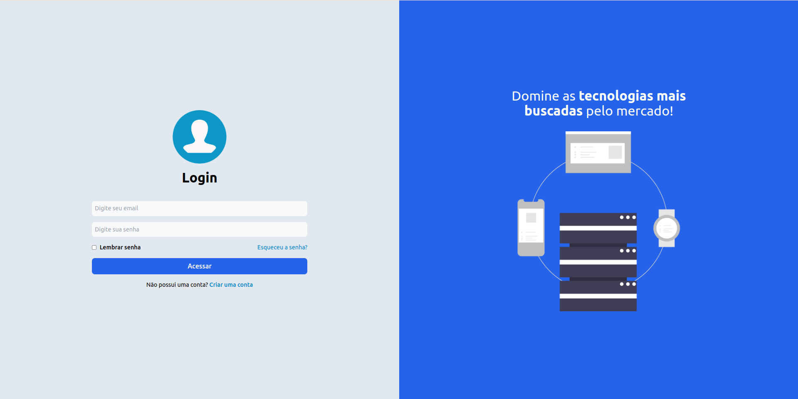
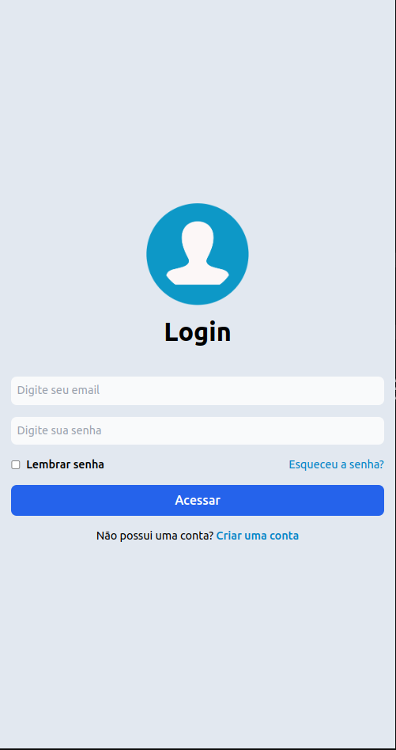

# Tela de Login Responsiva 

- Tela de login responsiva criada utilizando o framework CSS Tailwind.
- Desenvolvido primeiro com a metodologia Mobile First, depois para desktop.
- Compatível com todos os dispositivos móveis e com uma interface de usuário bonita e agradável.

